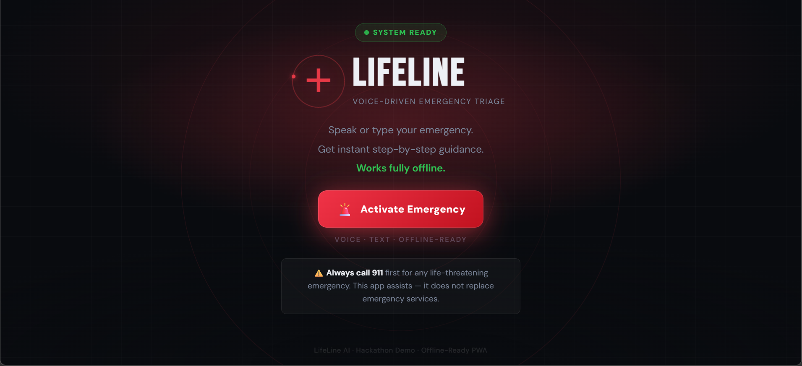
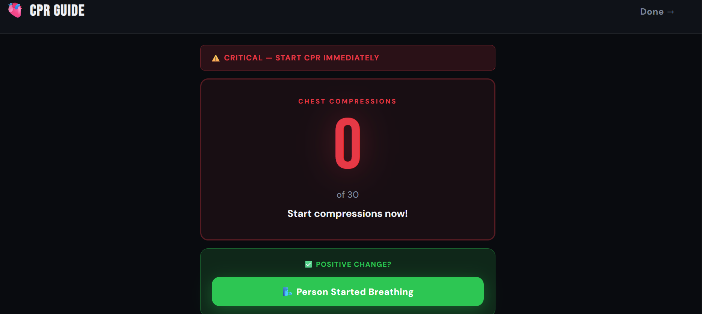
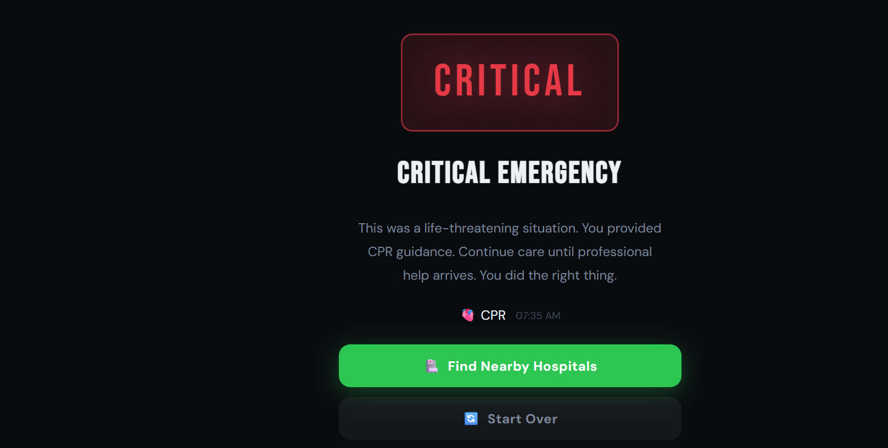

LifeLine AI – Voice-Driven Emergency Triage Assistant

Project Description
LifeLine is a browser-based emergency triage assistant designed to guide bystanders during the critical first minutes of a medical emergency.
It uses voice input and intelligent keyword classification to identify emergency situations like choking,cardiac arrest,unconsiousness and provides structured step-by-step guidance including CPR instructions, choking rescue steps, and emergency escalation advice.
The system works directly in the browser, requires no installation, and is optimized for fast response during high-stress situations.

Tech Stack
Frontend: HTML5, CSS3, JavaScript

Speech Recognition: Web Speech API

Voice Output: SpeechSynthesis API

Deployment: Firebase Hosting

Version Control: Git + GitHub

 Features

1.  Voice-driven emergency description 

2.  Intelligent keyword-based emergency classification

3. CPR module with:

Step-by-step instructions

Voice guidance

Compression counter with sound

4. Choking emergency module

Conscious & unconscious branching logic

5.  Auto-escalation:

Choking → unconscious → CPR flow

6.  Responsive mobile-friendly UI

7.  Nearby hospital redirection (Google Maps link)

8.  Works over HTTPS for microphone access

 Installation & Setup

1. Clone Repository

git clone https://github.com/keerthana123426/LIFELINE
cd lifeline-ai

2️. Run Locally

Simply open:

index.html

OR use a local server:

npx serve .

 Deployment

This project is deployed using Firebase Hosting.

Deploy Command

firebase deploy

Live Link

https://lifeline-9f13d.web.app/

 Live link works
HTTPS enabled
Microphone supported

 Architecture Overview

Flow:

1. User activates emergency mode

2. Voice or text input captured

3. Keyword classifier analyzes transcript

4. Emergency type detected:

CPR

Choking

Recovery

5. Relevant emergency module activated

6. Voice + visual instructions provided

7. Escalation logic applied if condition worsens

 Project Structure

lifeline-ai/
│
├── index.html
├── style.css
├── script.js
├── manifest.json (optional PWA support)
├── firebase.json
├── .firebaserc
└── README.md

Screenshots

### Home Screen

### CPR Module

### Nearby hospitals information Module

Team Members

Keerthana John
Gayathri M H

